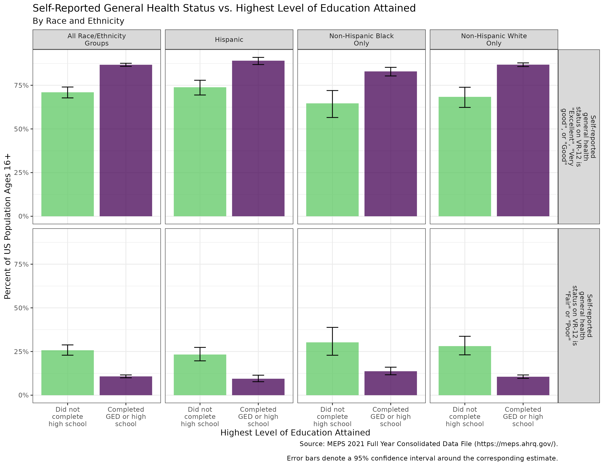
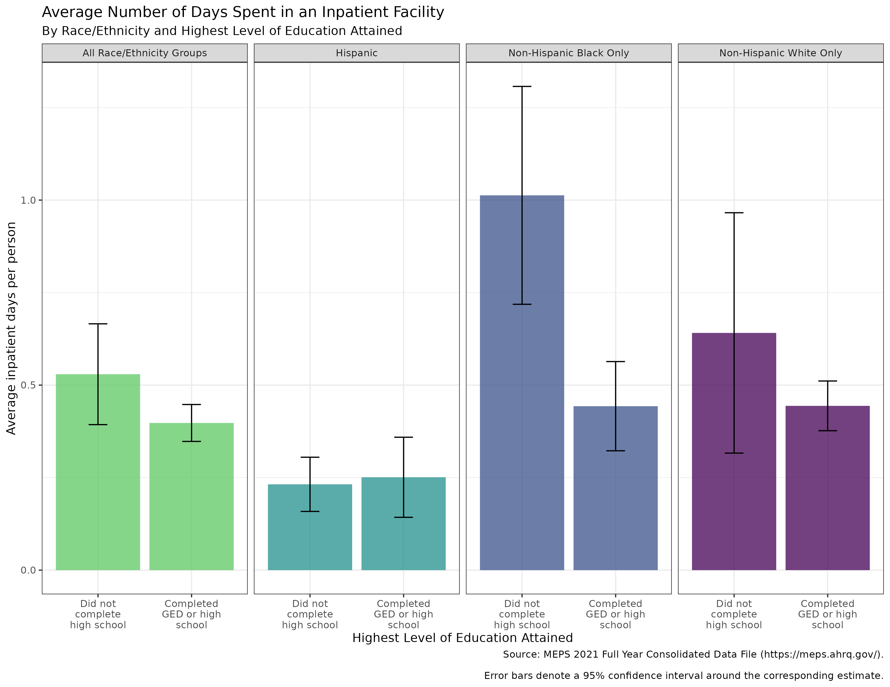
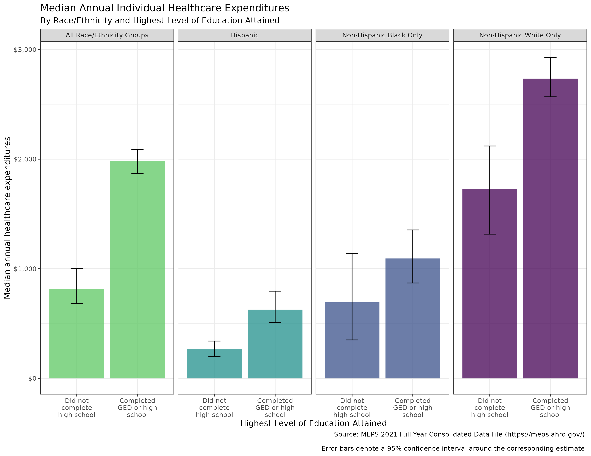
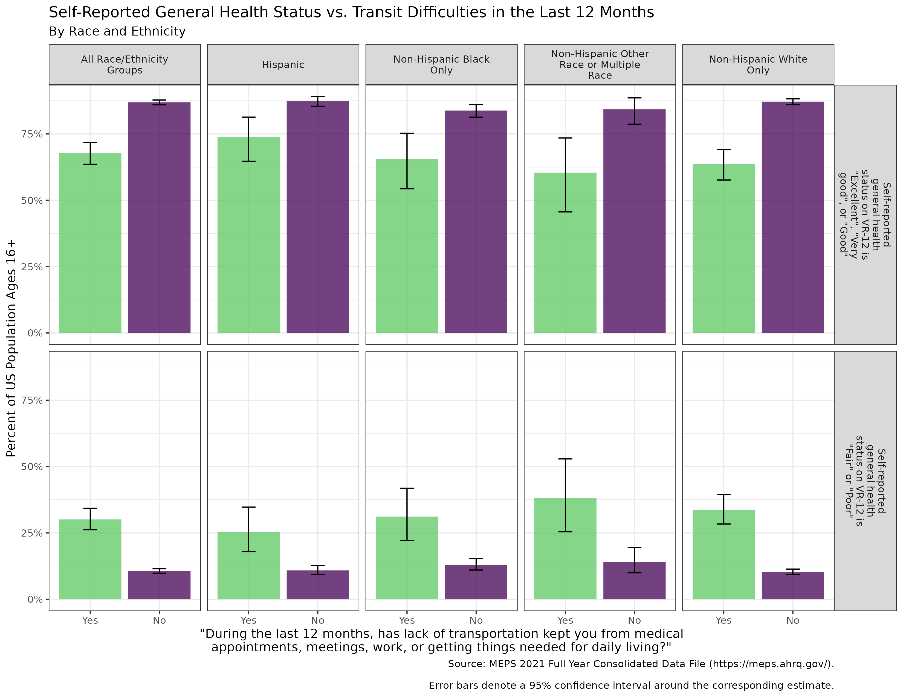
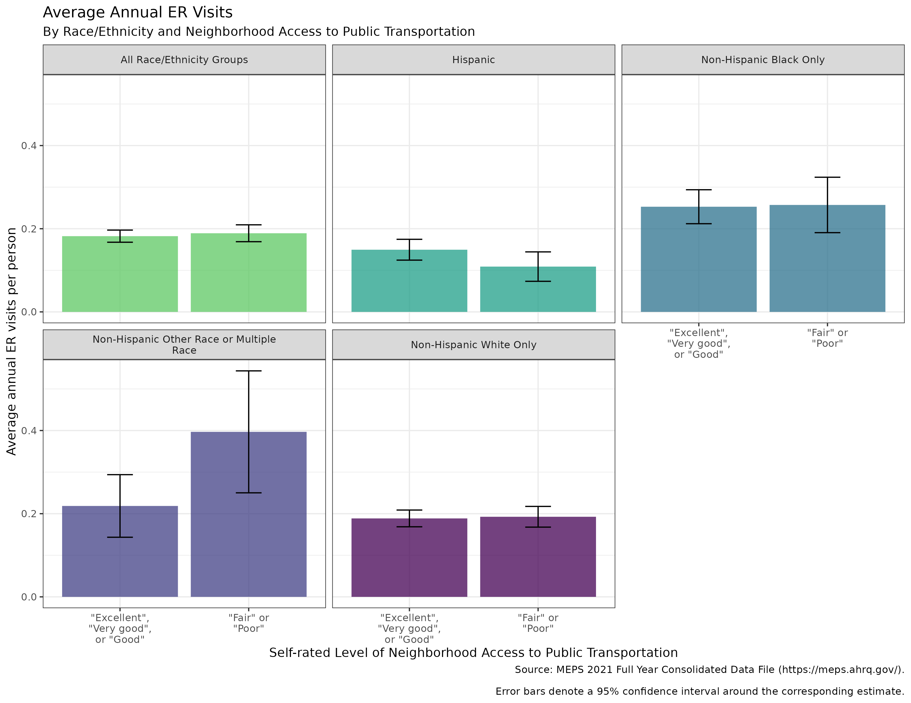
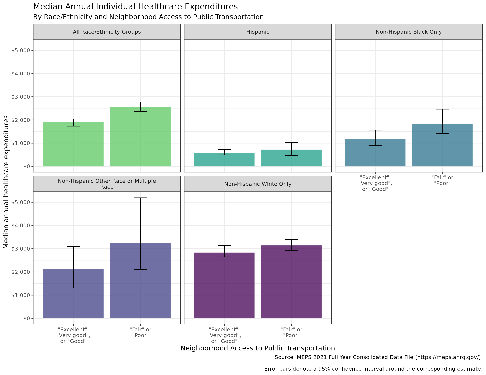
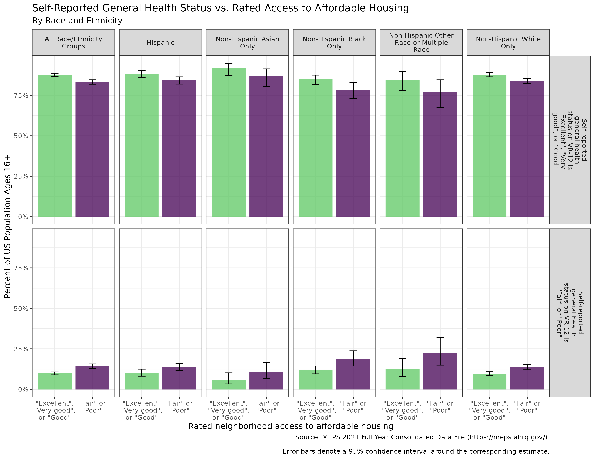
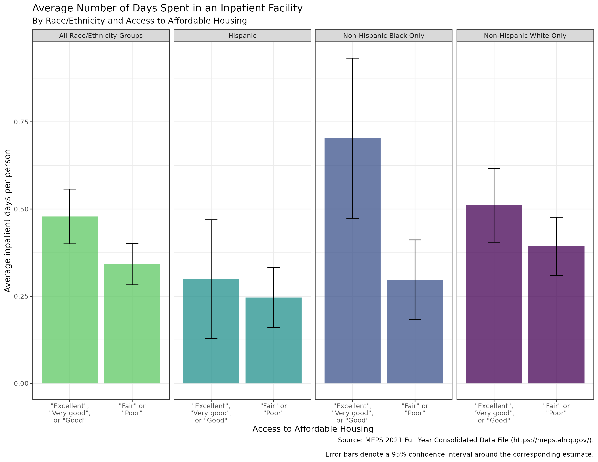
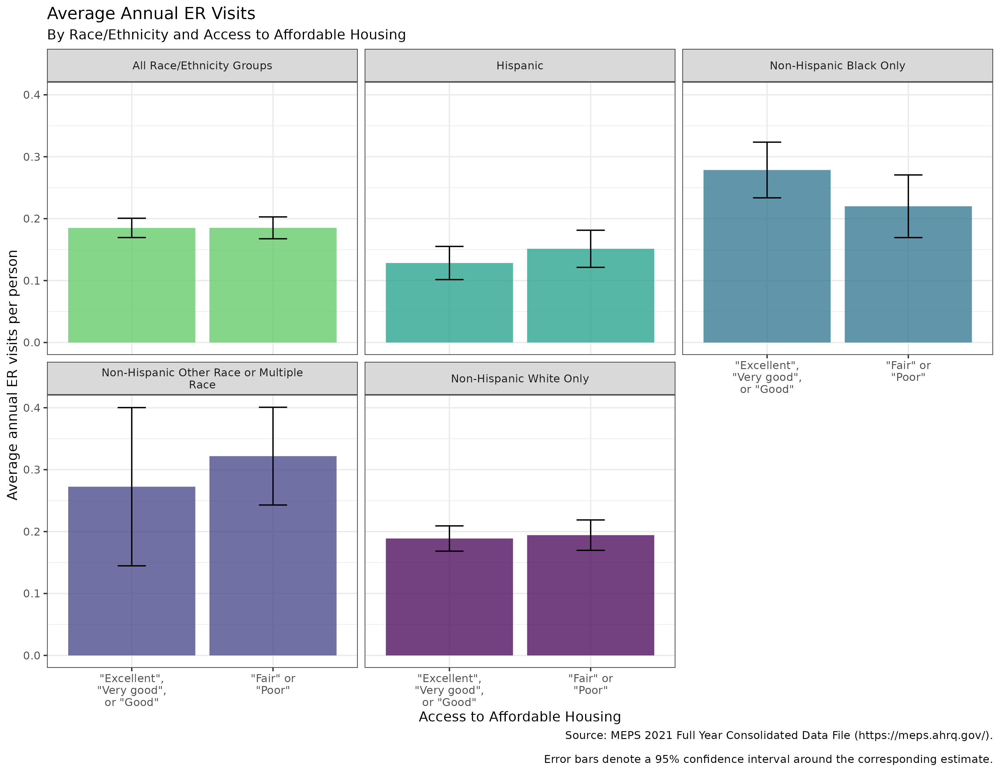
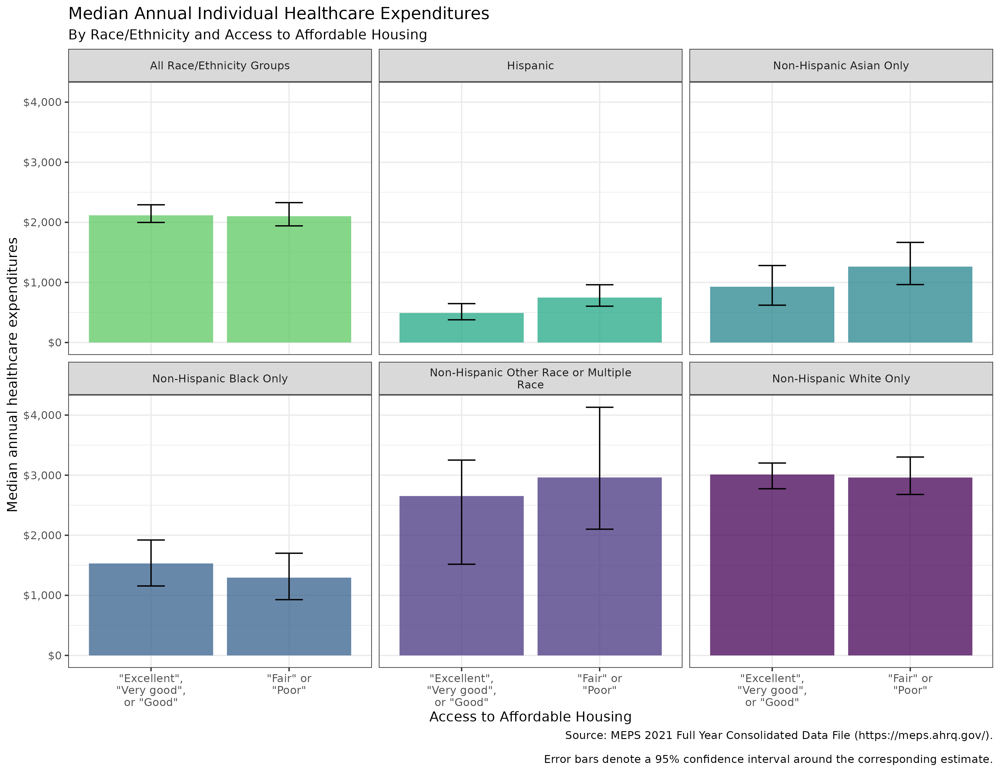

# Outcomes vs. SDoH Factors 

This repository contains example code demonstrating how to use the [Medical Expenditure Panel Survey](https://meps.ahrq.gov/mepsweb/) PUF (Public Use Files) for the 2021 survey year to construct estimates (with confidence intervals!) around key health outcomes measures for the US population and the relationship between these outcomes measures and key Social Determinants of Health (SDoH) factors which have been shown in the literature to be most strongly associated with healthcare outcomes and costs.

Due to sample sizes which are insufficient (n < 60, per [MEPS precision standards guidelines](https://meps.ahrq.gov/survey_comp/precision_guidelines.shtml)) for producing estimates, demographic breakouts for populations designated `Non-Hispanic Asian` and `Non-Hispanic Other Race or Multiple Race` are not included in all visuals. Sample size totals for these exhibits are available in the following tables:

* [HS Graduation](outputs/data/sample_size_check_hsgrad.csv)
* [Transit Availability](outputs/data/sample_size_check_transit.csv)
* [Affordable Housing](outputs/data/sample_size_check_housing.csv)

The work in this repository constitutes my own work and assertions and should not be considered associated, affiliated, or blessed in any way by my employer, which did not review this code or the results in the slightest before I put them on this repository. I make no guarantee of the accuracy of these results. You are free to use these results for any project, but you do so at your own risk.

## High School Graduation

[Supporting data](outputs/data/hsgrad_vs_genhealth.csv)

[Supporting data](outputs/data/hsgrad_vs_ip.csv)

[Supporting data](outputs/data/hsgrad_vs_ed.csv)

[Supporting data](outputs/data/hsgrad_vs_totexp.csv)

## Neighborhood Availability of Public Transit

[Supporting data](outputs/data/transit_vs_genhealth.csv)

[Supporting data](outputs/data/transit_vs_genhealth.csv)

[Supporting data](outputs/data/transit_vs_genhealth.csv)

[Supporting data](outputs/data/transit_vs_genhealth.csv)

## Availability of Affordable Housing

[Supporting data](outputs/data/housing_vs_genhealth.csv)

[Supporting data](outputs/data/housing_vs_genhealth.csv)

[Supporting data](outputs/data/housing_vs_genhealth.csv)

[Supporting data](outputs/data/housing_vs_genhealth.csv)